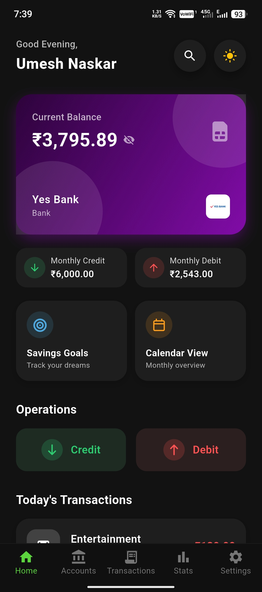
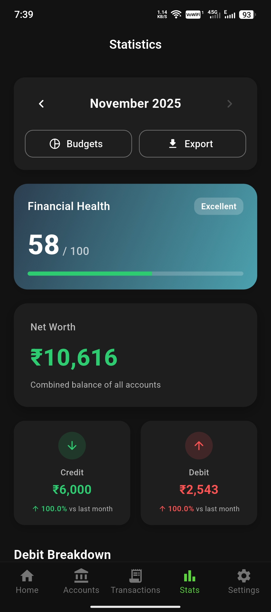

  

<h1 align="center">💸 SpendX - Premium Offline Expense Tracker</h1>

<b>Fast, private, and ad-free financial management for everyone.</b>

  

  
  
  
  

---

## 🚀 Overview

**SpendX** is a sophisticated, privacy-focused expense tracker designed to help you take control of your finances without compromising your data. Built with Flutter, it offers a premium user experience with glassmorphic designs, smooth animations, and powerful features—all while working completely offline.

---

## 🏆 Key Features

### 💰 Comprehensive Financial Tracking
- **Smart Transactions**: Easily log income, expenses, and transfers with categorized tags.
- **Recurring Transactions**: Set up automated rules for salaries, subscriptions, and bills.
- **Multiple Accounts**: Manage various bank accounts, cash wallets, and digital wallets in one place.

### 🎯 Goals & Budgeting
- **Smart Budgets**: Set monthly spending limits and get real-time alerts.
- **Savings Goals**: Create custom goals (e.g., "New Car", "Vacation") and track your progress with visual indicators.
- **Success Feedback**: Enjoy premium animations and feedback when you reach your milestones.

### 📊 Analytics & Reports
- **Visual Statistics**: Interactive charts and graphs to analyze your spending habits.
- **PDF Export**: Generate detailed financial reports for any date range.
- **CSV Support**: Export your data for use in Excel or other tools.

### 🔒 Security & Privacy
- **Biometric Lock**: Secure your financial data with Fingerprint or Face ID.
- **Offline First**: Your data never leaves your device. No servers, no cloud, no tracking.
- **Encrypted Backups**: Create password-protected backups to keep your data safe.
- **Reset App**: Securely wipe all data with a confirmation safeguard.

### 🎨 Premium Experience
- **Modern UI**: Beautiful glassmorphic design with vibrant gradients.
- **Dark/Light Mode**: Fully supported themes for comfortable viewing day or night.
- **Indian Rupee (₹)**: Native support for Indian currency formatting.

---

## 💾 Installation

1. [**Download the latest APK**](https://github.com/OfficialSpendX/SpendX/releases)
2. On Android, tap the APK file to install.
3. Allow installation from "Unknown Sources" if prompted.
4. Open SpendX and start your journey to financial freedom!

---

## 📷 Screenshots

  <!-- Replace with actual screenshot paths -->
  
  
  
  

---

## 🛠️ Tech Stack

- **Framework**: [Flutter](https://flutter.dev/)
- **Database**: [Hive](https://docs.hivedb.dev/) (NoSQL, fast & secure)
- **State Management**: [Provider](https://pub.dev/packages/provider)
- **Security**: [Flutter Secure Storage](https://pub.dev/packages/flutter_secure_storage) & [Local Auth](https://pub.dev/packages/local_auth)
- **UI Components**: [Glassmorphism](https://pub.dev/packages/glassmorphism), [FontAwesome](https://pub.dev/packages/font_awesome_flutter), [FL Chart](https://pub.dev/packages/fl_chart)

---

## 📚 License

SpendX is open-source software licensed under the [MIT License](LICENSE).

---

## 💬 Contact & Support

Have questions, suggestions, or need help?

📧 **Email**: contact.spendx@zohomail.in

---

Made with ❤️ for financial independence.

